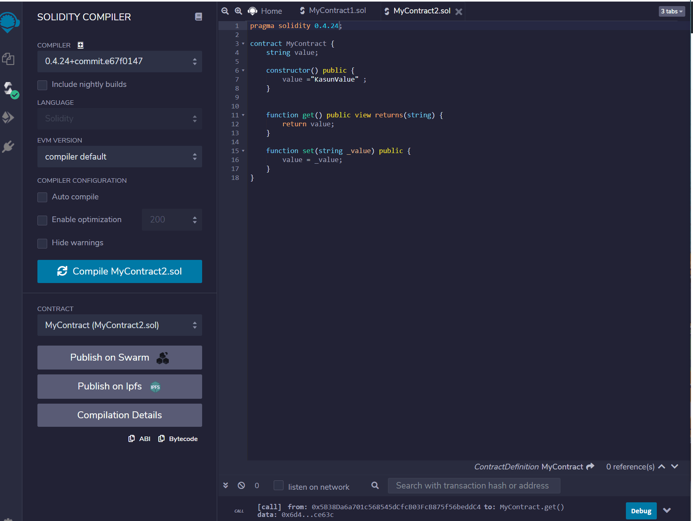
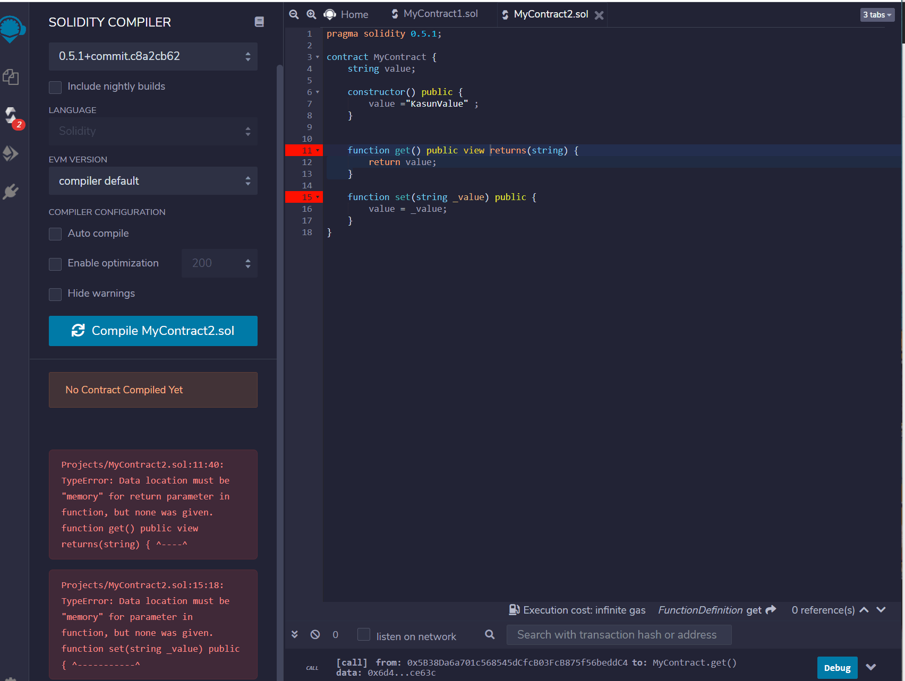
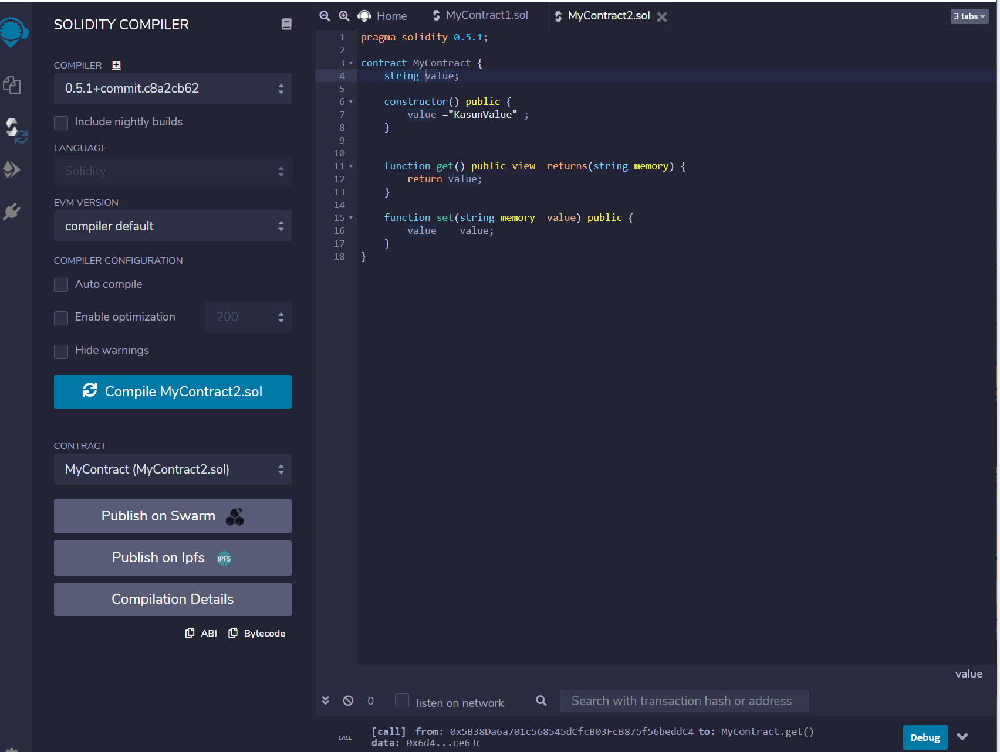
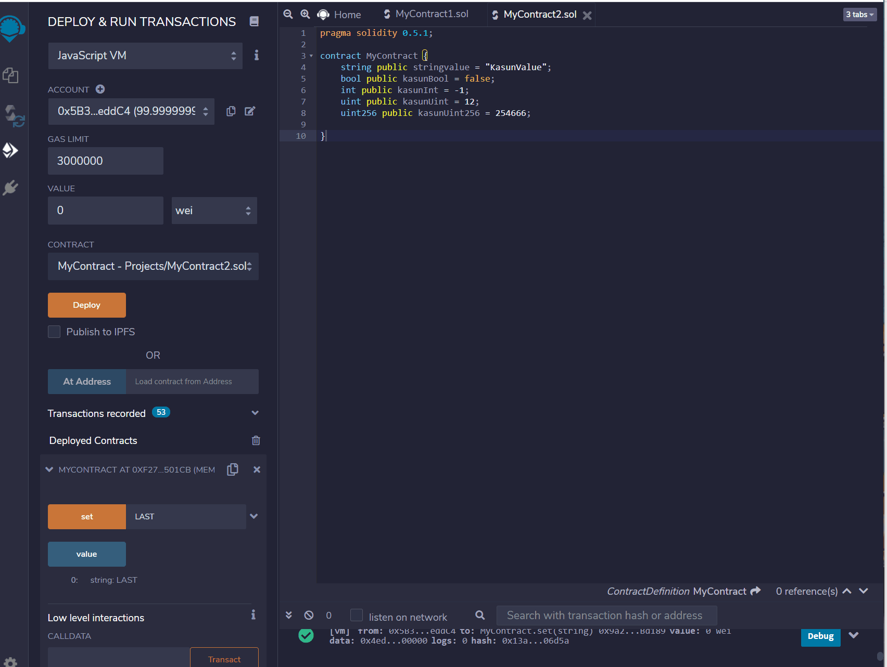

# Smart_Contract_Structures_Part_2

pending ......

The Smart_Contract_Structures_Part_1 we learned how to create two functions which is "set" function and "get" function, also we learned about constructor fuction.

Eterium has developed new virsion of solidity, so new versions last contracts can given a problem as below.

The error says it missing "memory" to run return. Following video shows how to solve that error!

In the second part of the smart contract, we are trying to minimize the coding we have to use. In newer versions, the get function already comes with if we make the string value public. In order to do that, we can put " string public value." Also, we can make the constructor default. So, you can see below that code also given the same thing as part I. 

#### How to add bool, init, and uint? 

"bool" is the code we use to put true or false in it, "int" is the code we use to put numbers, and when we use "int" the numbers can be negative or positive. "uint" also is the code we use for numbers but in "uint" we cant use negative. We can put how many bites should use in uint as "uint256" 

#### What is enum? 
"Within your smart contract, Solidity will automatically handle converting names to ints for you. If you declare an enum like: enum Colors {Red, Orange, Yellow, Green, Blue, Purple} then elsewhere in the contract you could refer to Colors.Red and not have to worry about it actually being a 0 in memory." So, it is basically red = 0, Orange = 1, Yellow = 2 .. etc.. (https://ethereum.stackexchange.com/questions/57775/enum-in-solidity-vs-const)

### Scenario:
Let's see someone go to the lavatory on an airplane, and someone is using that. So, you have to wait till the room is ready. We can use blockchain to work on this door. 

